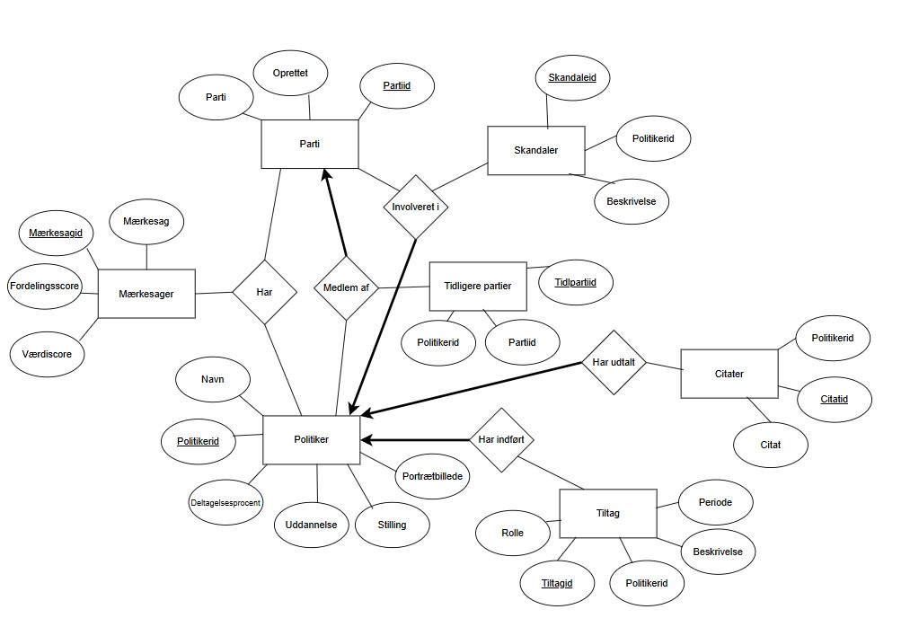

# tingr

## SETUP: (python3 or py)
python3 -m venv .venv
source .venv/bin/activate
pip install -r requirements.txt

These are the steps we use on our machines.

1. Create *'tingr'* database on system (linux)

sudo -u postgres psql -c "CREATE DATABASE tingr;"

2. Create *user credentials*

sudo -u postgres psql -c "CREATE USER username WITH PASSWORD 'yourpassword';"

3. *Set user privileges* on the tingr database

sudo -u postgres psql -c "GRANT ALL PRIVILEGES ON DATABASE tingr TO username;"

sudo -u postgres psql -d tingr -c "GRANT ALL ON SCHEMA public TO username;"

4. Update *database.py* with your credentials

## USE:

*Run "run.sh"*, or run "flask_server.py" manually with your own python path if it isn't python3.
Server opens on http://127.0.0.1:8000/

Pick your starting politician. 

Next page presents politicians that relate politically to this person. 

"Swipe" by liking or rejecting a politician.

Each like adds a politician to your bag (max of 6, can be removed and replaced).

At 6/6 politicians you have the option of seeing your most related party and other stats. Same option is given when no more politicians are left to swipe.

